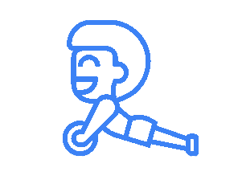

<div align="center">


  
  
# BTY 
  
### Built by: **[Ryan Q Le](https://www.linkedin.com/in/ryanqle/)**


[](https://GitHub.com/Naereen/StrapDown.js/graphs/commit-activity)


  


## **[Be Better Than Yesterday](https://bty-deploy.herokuapp.com/)**
</div>


### What is BTY:

Introducing our fitness tracker, **Better Than Yesterday**, designed to help you stay fit and healthy even while you're at your desk! With a variety of office-friendly exercises like seated leg raises, desk push-ups, and chair dips, this app makes it easy for users to incorporate physical activity into their workday. Say goodbye to sedentary habits and hello to a healthier, more active lifestyle with our desk-friendly fitness tracker.

<div align="center">

#### Home Page


#### Signup/Login


#### User Fitness Log


#### Workout Session


</div>

## Associated Links:

**[TRELLO](https://trello.com/b/c8Jv2E0V/project-3)**
**[Wireframe](https://whimsical.com/bty-fitness-wireframe-R6iCtnaHvziuEHUBCcwpj6)**
**[ERD](https://whimsical.com/bty-fitness-erd-EWav2caMsRxMUxgCzoWxNx)**

## About This Project
Written for **General Assembly Software Engineering Immersive Bootcamp**

BTY is a MERN stack single page application. Built over the course of 10-days, the app includes Express backend via AJAX, token-based authentication, and restriction of CUD data to authenticated users.

The name is an homage to my SEI cohort where we strive to be better than yesterday on our journey to becoming software engineers. While on the journey, we shouldn't forego our own physical health while sitting in front of a computer. Thus the idea of a calisthenics fitness tracker with workouts that you can do at your desk.

### Code Snippets

These portions of code demonstrates the functionality of `React` and the usage of `AJAX` requests to communicate with the back-end server.

```JSX
useEffect(() => {
    async function getSessionData() {
      const sessionData = await fitnessLogAPI.getSession(id);
      setSession(sessionData);
    }
    getSessionData();
  }, [showAddExercise]);

  async function handleEndWorkout() {
    await fitnessLogAPI.endWorkout(id);
    navigate(`/fitnesslog`)
  }

  async function handleAddWorkout() {
    setShowAddExercise(true);
  }
```
```JSX
export function getSession(sessionId){
    return sendRequest(`${BASE_URL}/${sessionId}`)
}

export function endWorkout(sessionId){
    return sendRequest(`${BASE_URL}/${sessionId}/end`, 'POST')
}
```

## Future Plans
- [] Implement a timer for users to keep track of how long their workout session was
- [] Implement user goals and track PRs
- [] Implement a calorie counter that estimates total calories burned per workout